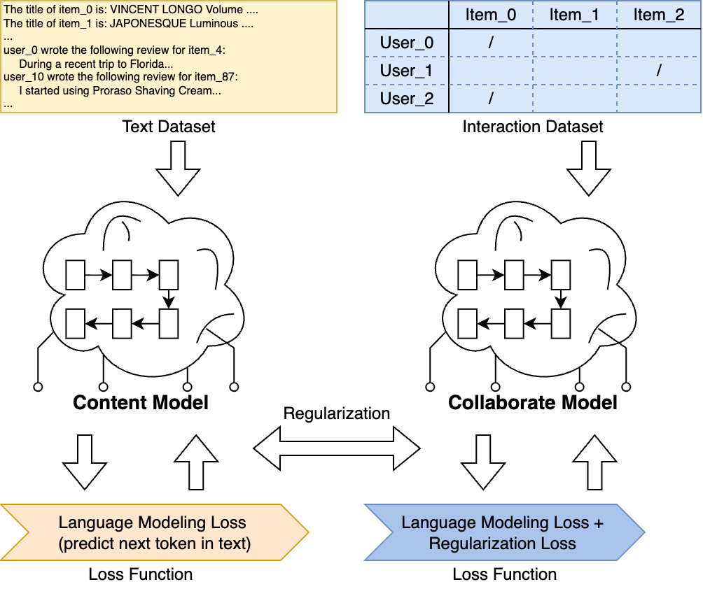
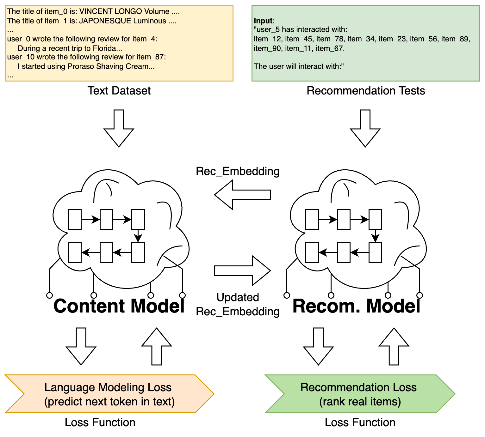

## Additional Technical Details related to LLM4Rec Training Progress

In this section, we provide some additional technical details related to the training progress of LLM4Rec models, which may be useful for understanding the training dynamics and performance.

### Separation of Content and Collaborative Models
The implementation separates the training of content-based and collaborative-based models. 

When you read the training scripts, you will see two distinct model classes: 
- `ContentGPTForUserItemWithLMHeadBatch` for `content_model`
-  `CollaborativeGPTwithItemLMHeadBatch` for `collaborative_model`.

The reason of this separation is that, the review data and interaction data are different in nature. The content model is trained on text data (reviews), while the collaborative model is trained on user-item interaction sequences.

- **content_model** learns from text (item titles, brands, categories, descriptions, reviews).
- **collaborate_model** learns from user–item interactions (the sequence of items a user clicked/bought).

Keeping them separate prevents the text signal and the interaction signal from fighting each other. Later, we align them so they agree. 

**Overall procedure** is: In the pre-training stage, the two models are trained parallelly. And later in the fine-tuning stage, we train the recommendation model based on the collaborative model, while still using the content model for regularization.


#### Pretraining (`llm4rec_training.py`)
This training script orchestrates the two-stage pretraining: (1) content-based and (2) collaborative-based.

|  |
|:---------------------:|
| Fig 1: the pretraining procedure |

- **Model setup**: 
    The script prepares the model config by extending GPT-2’s config with `num_users` and `num_items`. It then instantiates two separate GPT-2 based models:

        - The content model: create a GPT-2 (with BC) instance and wrap it in `GPT4RecommendationBaseModel`. Then create `ContentGPTForUserItemWithLMHeadBatch` with that base.

        - The collaborative model: similarly, create another GPT-2 instance, wrap it, and then `CollaborativeGPTwithItemLMHeadBatch`.

    These two models (`content_model` and `collaborative_model`) are separate but initialized from the same GPT-2 weights (assuming both `GPT2ModelWithBC` instances load the pretrained GPT-2 parameters) so that they start from a common point. The user/item embedding matrices in each are initialized randomly as per code. Essentially, at the very start, the two models have identical transformer weights but different initial embeddings for the new tokens.

- **Pretraining Stage 1 – Content-based**:
    The script trains `content_model` first, while `collaborative_model` is untouched. Similar to regular ML model training process, it sets up an optimizer for the content model’s parameters and loops for a specified number of epochs. 

    The loss function is defined in `ContentGPTForUserItemWithLMHeadBatch`:
    ```python
        loss_fct = nn.CrossEntropyLoss()  # standard language modeling loss
    ```

    By the end of it, `content_model`should have learned meaningful representations for user and item tokens in context of text.

- **Pretraining Stage 2 – Collaborative-based**:
    After content pretraining finishes, the script moves on to collaborative pretraining. 
    Now it will train `collaborative_model`, but importantly it will use the `content_model`’s knowledge for **regularization**. 
    The content model can be either fixed (as a teacher) or potentially still trainable. 
    The purpose is to ensure that both models produce similar embeddings. While the embedding is more likely related to the textual relationships, we mainly use the content model as the guide. 

    You will see in the code:
    ```python
        with torch.no_grad():
                content_embeds = torch.cat(
                    (accelerator.unwrap_model(content_model).base_model.embed(input_ids_prompt),
                    accelerator.unwrap_model(content_model).base_model.embed(input_ids_main)),
                    axis=1
                ).to(device)

        # Forward pass
        outputs = collaborative_model(..., content_embeds=content_embeds)
    ```
    where the embedding layer from `content_model` is loaded to `collaborative_model` for regularization. 

    The loss function is defined in `CollaborativeGPTwithItemLMHeadBatch`:
    ```python
        loss_fct = CrossEntropyLoss()

        ...

        # Mutual regularization loss
            if regularize:
                collaborative_embeds = torch.cat(
                    (self.base_model.embed(input_ids_prompt),
                     self.base_model.embed(input_ids_main)),
                    axis=1
                )
                regularize_loss = lambda_V * torch.mean(
                    nn.MSELoss(reduction='sum')(
                        collaborative_embeds,
                        content_embeds)
                )
                loss += regularize_loss
                outputs = (loss, regularize_loss) + outputs
            else:
                outputs = (loss,) + outputs
    ```
    
    You can see now the `regularize_loss` is also added to the outputs for updating the embedding calculation of `collaborative_model`.

    By the end of this stage, `collaborative_model` has learned to model interaction sequences while staying aligned with the content model’s embedding space.

Note-1: The pretraining procedure as implemented is **sequential**: first content, then collaborative.  

Note-2: About "**C-Steps**": You may notice that in the code, there is a `C-steps`. When the collaborative-based model is being trained, for every `50` epochs, the content-based model is trained for one epoch, with the collaborative-based model's embedding layer loaded to content-based model for regularization. This is to ensure the content model does not become stale and continues to adapt slightly based on the collaborative model's learning. This is the reason why in the previous graph, the regularization arrow goes both ways. 

#### Fine-Tuning (`llm4rec_finetuning.py`)
This script takes the pretrained models and performs the final fine-tuning to directly optimize recommendation accuracy.

|  |
|:---------------------:|
| Fig 1: the finetuning procedure |

Main steps in `llm4rec_finetuning.py`:

- **Loading pretrained models**: 
    It reads the saved checkpoint files. The code creates a GPT-2 config (with num_users/num_items) same as before. 

    Now the difference is, the `collaborative_model` is changed to `CollaborativeGPTwithItemRecommendHeadBatch`, which is the recommendation model we would finally provide. 
    
    Then it instantiates `content_model` and `collaborate_model`.

    Note that the embedding layers are loaded:
    ```python
            base_model.user_embeddings.load_state_dict(torch.load(bt4222_content_based_gpt2_pretrained_user_emb_path, map_location=device))
            base_model.item_embeddings.load_state_dict(torch.load(bt4222_content_based_gpt2_pretrained_item_emb_path, map_location=device))
    ```


- **Recommendation-oriented Fine-tuning**: 
    Optimizes the model with masked user-item prompts to predict held-out items directly, as we discussed in the notebook.

    The loss function is defined in `CollaborativeGPTwithItemRecommendHeadBatch`, it is more for recommendation task:
    ```python
        # Calculating the multinomial loss
        neg_ll = -torch.mean(torch.sum(item_log_probs * target_ids, dim=-1))
        if regularize:
            # User/Item token embeddings only appear in the prompt
            rec_embeds_prompt = self.base_model.embed(input_ids)
            rec_embeds_target = self.base_model.embed(main_ids)
            rec_embeds = torch.cat(
                (rec_embeds_prompt, rec_embeds_target),
                axis=1
            )
            regularize_loss = lambda_V * torch.mean(
                nn.MSELoss(reduction='sum')(
                    rec_embeds,
                    content_embeds)
            )
            neg_ll += regularize_loss
            outputs = (neg_ll, regularize_loss, item_log_probs)
        else:
            outputs = (neg_ll, item_log_probs)
    ```

    Note that the content model is also occasionally updated during fine-tuning in order to keep the embeddings aligned. The recommendation model's embedding layer is loaded on content model, then train over text data, and updated embedding layer is put back to recommendation model.

    ```python 
    if (epoch + 1) % 150 == 0:
            content_model.train()

            ...

            with torch.no_grad():
                    rec_embeds = accelerator.unwrap_model(collaborate_model).\
                                base_model.embed(input_ids_prompt).to(device)

                # Forward pass of the content GPT
                outputs = content_model(..., collaborative_embeds=rec_embeds)

            ...
    ```

- **Evaluation**: 
    Periodically evaluates the model’s recommendation accuracy (using **Recall** and **NDCG** metrics) on a validation set, ensuring the learned embeddings lead to meaningful recommendations.

At the end of fine-tuning, we expect the model to have learned to make accurate recommendations. The final model (collaborative_model with recommend head) can generate a ranked list of items for any user prompt by a single forward pass.
